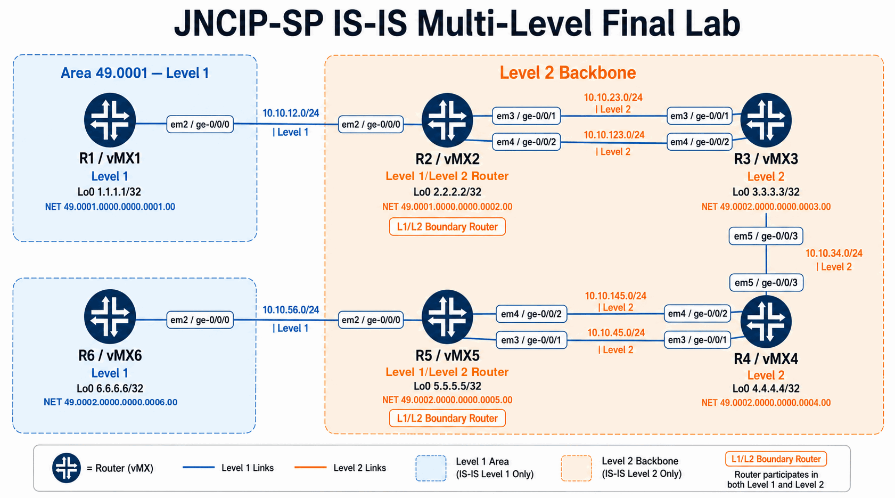

# IS-IS Multi-Level Topology

## Topology Summary

- R1 is a Level 1 router connected to the R2 Level 1/Level 2 router.
- R2, R3, R4, and R5 form the Level 2 backbone.
- R6 is a Level 1 router connected to the R5 Level 1/Level 2 router.
- R2-R3 and R4-R5 each use two parallel Level 2 links for ECMP and failure testing.
- All routed links use unique `/24` IPv4 subnets.
- R5 and R6 use area `49.0002`, matching the verified Level 1 adjacency.

The complete interface, addressing, NET, role, and expected-adjacency tables are maintained in the [authoritative design](../Design/README.md).
