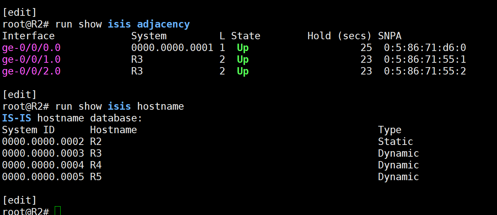
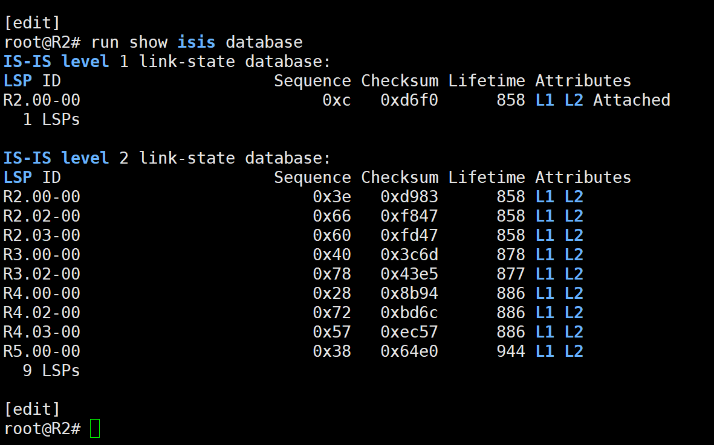
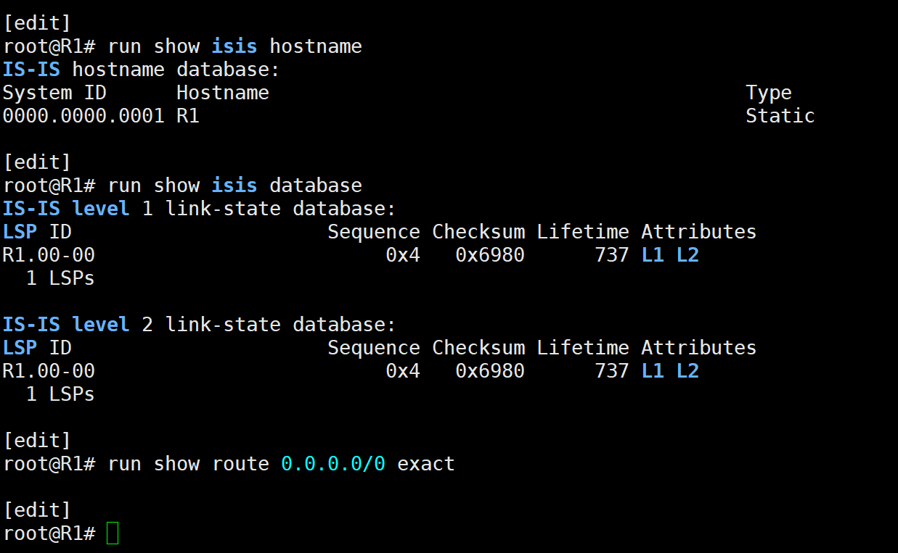
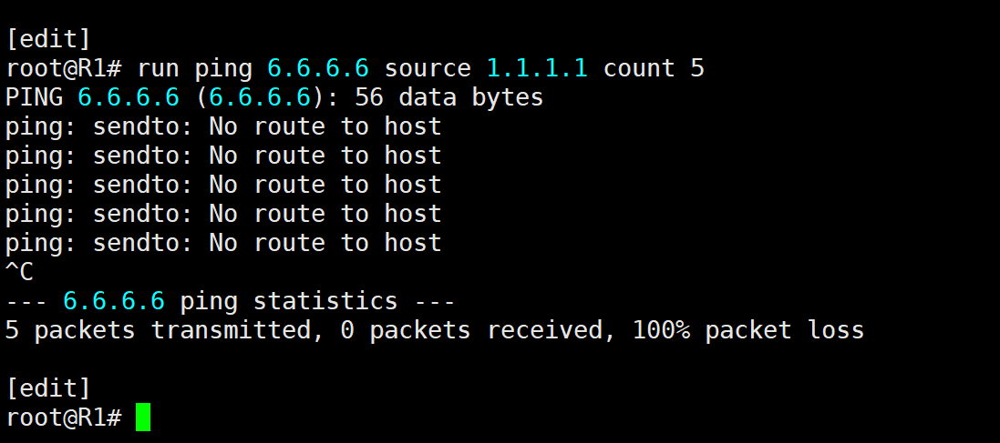
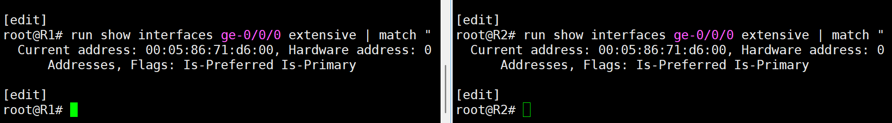
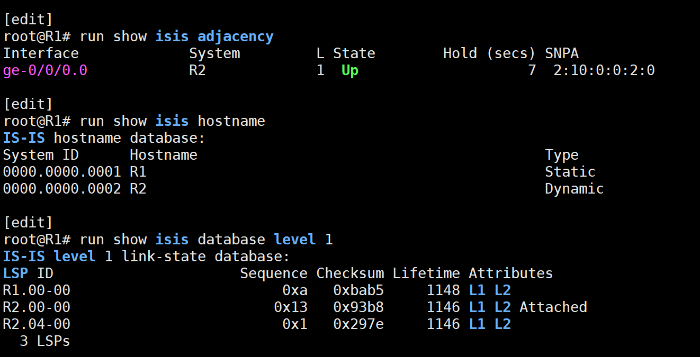
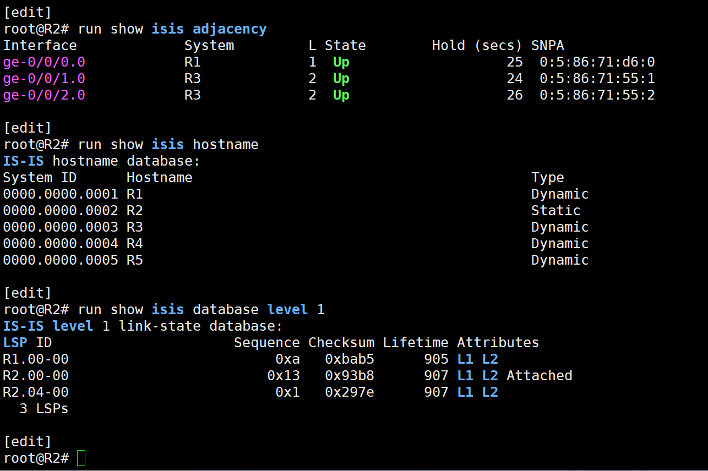
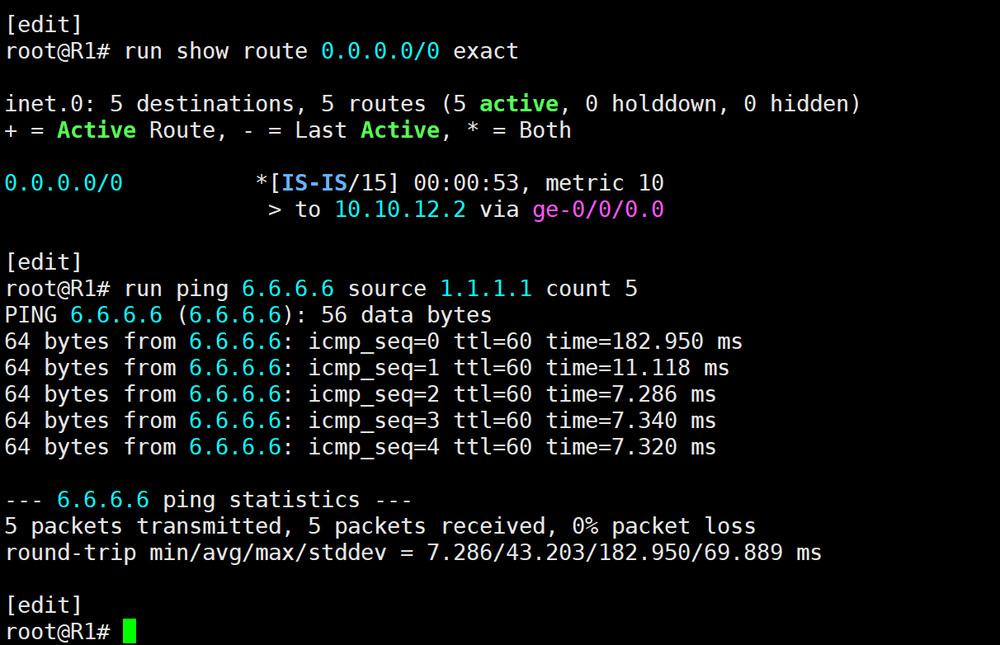

# IS-IS Troubleshooting Case: Duplicate vMX Interface MAC

## Summary

A real fault was discovered during an independent verification of the R1-R2 Level 1 area. The IS-IS adjacency remained `Up`, but the routers did not synchronize their Level 1 link-state databases. R1 therefore lost its IS-IS default route and could not reach the R6 loopback.

Read-only troubleshooting proved that R1 and R2 were using the same MAC address on `ge-0/0/0`:

```text
R1 ge-0/0/0: 00:05:86:71:d6:00
R2 ge-0/0/0: 00:05:86:71:d6:00
```

Both virtual routers also reported the same vMX chassis serial identity. This strongly indicates duplicated virtual hardware identity in the lab environment; the exact EVE-NG or hypervisor event that produced it was not independently proven.

## Initial Symptom

R2 reported its Level 1 adjacency to R1 as `Up`, but displayed R1 only as system ID `0000.0000.0001`. R1 was absent from R2's dynamic hostname table.



## Control-Plane Evidence

R2's Level 1 LSDB contained only its own LSP. R1's LSP was missing.



R1 likewise knew only its own hostname and LSP. Its lookup for `0.0.0.0/0` returned no route.



The forwarding impact was confirmed by a sourced ping from `1.1.1.1` to `6.6.6.6`: `No route to host` and 100% packet loss.



## Root Cause

Authentication checks on both routers showed `None` for IIH, CSNP, PSNP, and LSP authentication, disproving the initial authentication-mismatch hypothesis.

Interface inspection then proved that both ends of the R1-R2 Ethernet segment used the identical MAC address `00:05:86:71:d6:00`.



The duplicate MAC disrupted correct broadcast-LAN DIS/pseudonode behaviour and Level 1 LSP synchronization even though IIH processing kept the adjacency in the `Up` state.

## Corrective Change

Only R2 `ge-0/0/0` was changed to a unique locally administered unicast MAC:

```text
[edit interfaces ge-0/0/0]
+   mac 02:10:00:00:02:00;
```

The candidate configuration passed `commit check` before commit.

This is a targeted lab workaround. A complete infrastructure cleanup should ensure that every cloned vMX node receives unique virtual hardware identity and unique interface MAC addresses.

## Restoration Verification

On R1, R2 resolved dynamically, both router LSPs appeared, the R2 pseudonode returned, and R2 advertised the Attached attribute.



R2 independently showed R1 by hostname and the synchronized three-entry Level 1 LSDB.



R1 then relearned `0.0.0.0/0` through `10.10.12.2`, and the sourced ping to `6.6.6.6` succeeded with five of five replies and 0% packet loss.



## Fault Chain

```text
Duplicate MAC on R1 and R2 ge-0/0/0
  -> incorrect broadcast-LAN DIS/pseudonode behaviour
  -> Level 1 LSDB not synchronized
  -> dynamic hostname mappings not learned
  -> R1 did not receive R2's Attached information
  -> R1 default route disappeared
  -> R1-to-R6 traffic failed
```

## Lessons Learned

- An `Up` IS-IS adjacency does not prove that the LSDB is synchronized.
- A missing dynamic hostname can be an early symptom of missing remote LSPs.
- Verify the control plane, RIB, and forwarding result separately.
- Test hypotheses with read-only evidence; authentication was checked and ruled out.
- In virtual labs, duplicate node identity can create protocol failures that resemble routing configuration errors.
