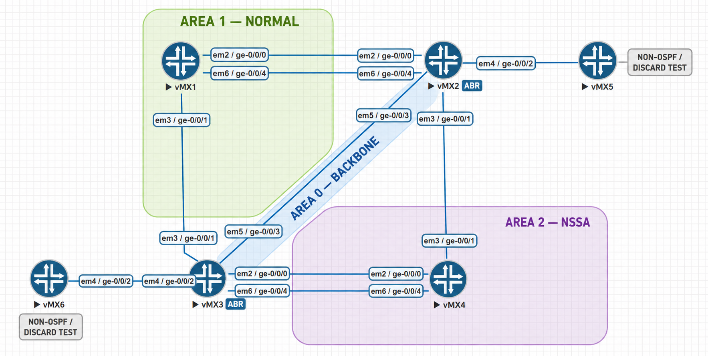

# OSPF Multi-Area Lab Design

This document is the source of truth for the six-router Juniper vMX OSPFv2 lab.

## Topology

## Router Roles

| Router | Router ID | OSPF role |
|---|---:|---|
| R1 | 1.1.1.1 | Internal Area 1 router |
| R2 | 2.2.2.2 | ABR for Areas 0, 1, and 2; ASBR for routing-policy tests |
| R3 | 3.3.3.3 | ABR for Areas 0, 1, and 2 |
| R4 | 4.4.4.4 | Internal Area 2 router |
| R5 | 5.5.5.5 | Non-OSPF discard/static-route test endpoint |
| R6 | 6.6.6.6 | Non-OSPF discard/static-route test endpoint |

## OSPF Areas

| Area | Type | Participating links |
|---|---|---|
| 0.0.0.0 | Backbone | R2–R3 |
| 0.0.0.1 | Normal | R1–R2 primary, R1–R2 secondary, R1–R3 |
| 0.0.0.2 | NSSA | R2–R4, R3–R4 primary, R3–R4 secondary |

R2 and R3 provide connectivity between the backbone and the non-backbone areas.

## Interface and Addressing Plan

| Link | Router interface | IPv4 address | Peer interface | Peer IPv4 address | Area |
|---|---|---:|---|---:|---|
| R1–R2 primary | R1 `ge-0/0/0.0` | 10.10.12.1/24 | R2 `ge-0/0/0.0` | 10.10.12.2/24 | Area 1 |
| R1–R2 secondary | R1 `ge-0/0/4.0` | 10.10.112.1/24 | R2 `ge-0/0/4.0` | 10.10.112.2/24 | Area 1 |
| R1–R3 | R1 `ge-0/0/1.0` | 10.10.13.1/24 | R3 `ge-0/0/1.0` | 10.10.13.3/24 | Area 1 |
| R2–R3 | R2 `ge-0/0/3.0` | 10.10.23.2/24 | R3 `ge-0/0/3.0` | 10.10.23.3/24 | Area 0 |
| R2–R4 | R2 `ge-0/0/1.0` | 10.10.24.2/24 | R4 `ge-0/0/1.0` | 10.10.24.4/24 | Area 2 |
| R3–R4 primary | R3 `ge-0/0/0.0` | 10.10.34.3/24 | R4 `ge-0/0/0.0` | 10.10.34.4/24 | Area 2 |
| R3–R4 secondary | R3 `ge-0/0/4.0` | 10.10.134.3/24 | R4 `ge-0/0/4.0` | 10.10.134.4/24 | Area 2 |
| R2–R5 test link | R2 `ge-0/0/2.0` | 10.10.25.2/24 | R5 `ge-0/0/2.0` | 10.10.25.5/24 | Non-OSPF |
| R3–R6 test link | R3 `ge-0/0/2.0` | 10.10.36.3/24 | R6 `ge-0/0/2.0` | 10.10.36.6/24 | Non-OSPF |

## Loopbacks

| Router | Loopback |
|---|---:|
| R1 | 1.1.1.1/32 |
| R2 | 2.2.2.2/32 |
| R3 | 3.3.3.3/32 |
| R4 | 4.4.4.4/32 |
| R5 | 5.5.5.5/32 |
| R6 | 6.6.6.6/32 |

## Parallel-Link Design

Two redundant equal-cost link pairs were added:

- R1–R2 in Area 1
- R3–R4 in Area 2

With both links operational, OSPF calculates two equal-cost next hops. Installing simultaneous load-sharing next hops in the forwarding table requires a separate Junos forwarding-table policy and is outside this routing-protocol test.

## Controlled Failure Tests

### Area 2

1. Verified both R3–R4 adjacencies and equal-cost routes.
2. Disabled primary interface `R3 ge-0/0/0`.
3. Verified the secondary path through `ge-0/0/4`.
4. Confirmed loopback reachability with sourced ping.
5. Restored the primary link and verified both paths returned.

### Area 1

1. Verified both R1–R2 adjacencies and equal-cost routes.
2. Disabled secondary interface `R1 ge-0/0/4`.
3. Verified the primary path through `ge-0/0/0`.
4. Confirmed loopback reachability with sourced ping.
5. Restored the secondary link and verified both paths returned.

## Evidence

Baseline verification:

- [Area 2 parallel links](../Verification/39-ospf-area2-parallel-links-baseline.png)
- [Area 1 parallel links](../Verification/43-ospf-area1-parallel-links-baseline.png)

Failure and recovery:

- [Area 2 primary-link failure](../Troubleshooting/40-area2-primary-link-failure-backup-route.png)
- [Area 2 backup-path connectivity](../Troubleshooting/41-area2-backup-path-connectivity.png)
- [Area 2 recovery](../Troubleshooting/42-area2-parallel-links-recovered.png)
- [Area 1 secondary-link failure](../Troubleshooting/44-area1-secondary-link-failure-primary-route.png)
- [Area 1 primary-path connectivity](../Troubleshooting/45-area1-primary-path-connectivity.png)
- [Area 1 recovery](../Troubleshooting/46-area1-parallel-links-recovered.png)
